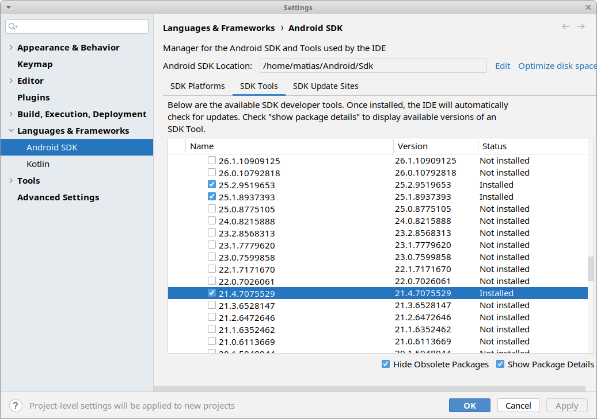
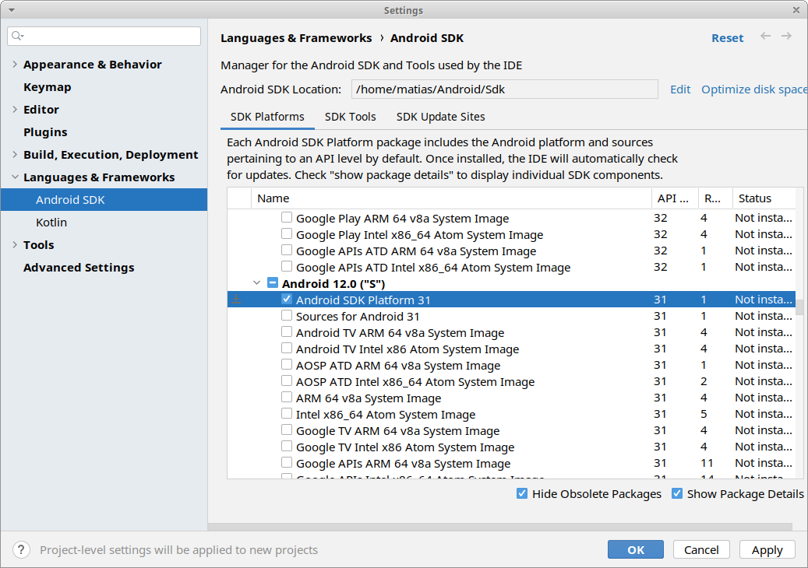
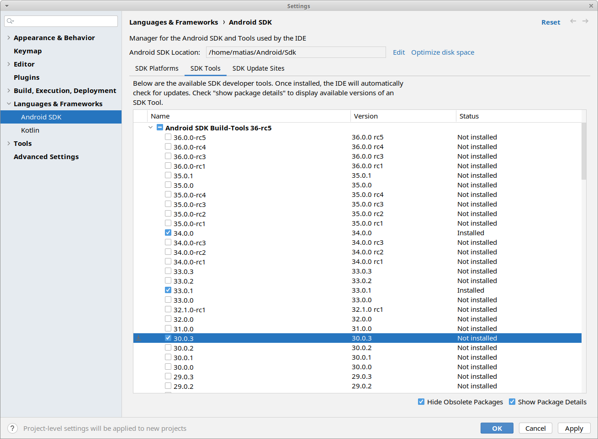

This repo contains prebuilt versions of Google's Swappy Frame Pacing library.

Compiled from source.

See [Releases page](https://github.com/godotengine/godot-swappy/releases).

# How to build from source

This script has only been tested on Ubuntu 24.04 LTS. I used Android Studio 2023.2.1.

**READ ALL THE STEPS BEFORE LAUNCHING THE SCRIPT**.

1. The script will checkout a specific commit hash. If you want a different one, Edit [build.bash](./build.bash) and change `SPECIFIC_REVISION` variable.
2. You **must** set environment variables `ANDROID_SDK` to point to Android SDK and `JAVA_HOME` to point to the Java installation (for best results, use the one bundled with Android Studio), and `ANDROID_NDK` to a specific NDK version (see Common Errors section).
   - gradle dropped support for `ANDROID_NDK` environment variable a long time ago, *however* the Gradle scripts in gamesdk check for this variable and re-added the functionality.
3. You **must edit** [local.properties](./local.properties) to have `sdk.dir` point to your Android SDK (i.e. same as `ANDROID_SDK`), and have `cmake.dir` point to where the CMake included in your Android SDK lives.

This script assumes you already have installed necessary dependencies such as repo, git, the Android SDK and Android Studio.

**Example:**

```bash
sudo apt install repo ninja-build git

export ANDROID_HOME=/home/matias/Android/Sdk
export JAVA_HOME=/home/matias/apps/android-studio/jbr
export ANDROID_NDK=/home/matias/Android/Sdk/ndk/21.4.7075529

./build.bash
```

## Extracting the files

The files will be generated at `build/package/local/gamesdk.zip`. Decompress it and extract `games-frame-pacing-release.aar`.

The files will be at `games-frame-pacing-release.aar_FILES/prefab/modules/swappy_static`.

Note that the library paths say: `android.arm64-v8a`, `android.x86_64`, etc. **Remove** the `android.` prefix.

# Common Errors

## "NDK not configured"

If you get the following error message:

```
org.gradle.api.InvalidUserDataException: NDK not configured. Download it with SDK manager. Preferred NDK version is '21.4.7075529'. 
```

You **must** install NDK version `21.4.7075529` (or whatever number it asks you). It says "preferred" but it's mandatory.
You may have others NDK versions installed, but the error won't go away until you install the exact version it is asking you.

Use the SDK Manager -> **SDK Tools**:



## Failed to find target with hash string 'android-31'

If you get the error:

```
Failed to find target with hash string 'android-31' in: /home/matias/Android/Sdk
```

Then you must install Android API 31 SDK.

Use the SDK Manager -> **SDK Platforms**:



## Failed to find Build Tools revision 30.0.3

Install Build Tools version 30.0.3

Use the SDK Manager -> **SDK Tools**:



## Other errors

Pay a lot of attention to the errors, it's very easy to get lost.

**For example all the following errors are completely misleading:**

```
> Task :buildSrc:compileKotlin
'compileJava' task (current target is 17) and 'compileKotlin' task (current target is 1.8) jvm target compatibility should be set to the same Java version.
w: /home/matias/SlowProjects/godot-swappy/build/gamesdk/buildSrc/src/main/java/com/google/androidgamesdk/AarPrefabPatcher.kt: (48, 13): 'createTempDir(String = ..., String? = ..., File? = ...): File' is deprecated. Avoid creating temporary directories in the default temp location with this function due to too wide permissions on the newly created directory. Use kotlin.io.path.createTempDirectory instead.
w: /home/matias/SlowProjects/godot-swappy/build/gamesdk/buildSrc/src/main/java/com/google/androidgamesdk/BuildInfoFile.kt: (52, 9): Parameter 'nativeLibraries' is never used

> Task :buildSrc:jar
:jar: No valid plugin descriptors were found in META-INF/gradle-plugins

> Task :buildSrc:compileTestKotlin
'compileTestJava' task (current target is 17) and 'compileTestKotlin' task (current target is 1.8) jvm target compatibility should be set to the same Java version.

FAILURE: Build failed with an exception.
```

This could get you completely side-tracked, because if you keep reading, it will tell you the following:

```
* What went wrong:
Could not determine the dependencies of task ':games-frame-pacing:verifyReleaseResources'.
> Failed to find target with hash string 'android-31' in: /home/matias/Android/Sdk

* Try:
> Run with --stacktrace option to get the stack trace.
> Run with --info or --debug option to get more log output.
> Run with --scan to get full insights.

* Get more help at https://help.gradle.org

Deprecated Gradle features were used in this build, making it incompatible with Gradle 8.0.
```

AHA! **Failed to find target with hash string 'android-31' in: /home/matias/Android/Sdk**. This is the root of the problem.

In rare cases, the root of the problem may be the first problem to appear, instead of the last one; and in that case you may have to scroll quite a bit.

For example if you force it to build with a newer NDK version than the recommended one, you will get errors C++ about function redeclarations with a different function signature, but at the bottom you will see Java errors that mislead you.
